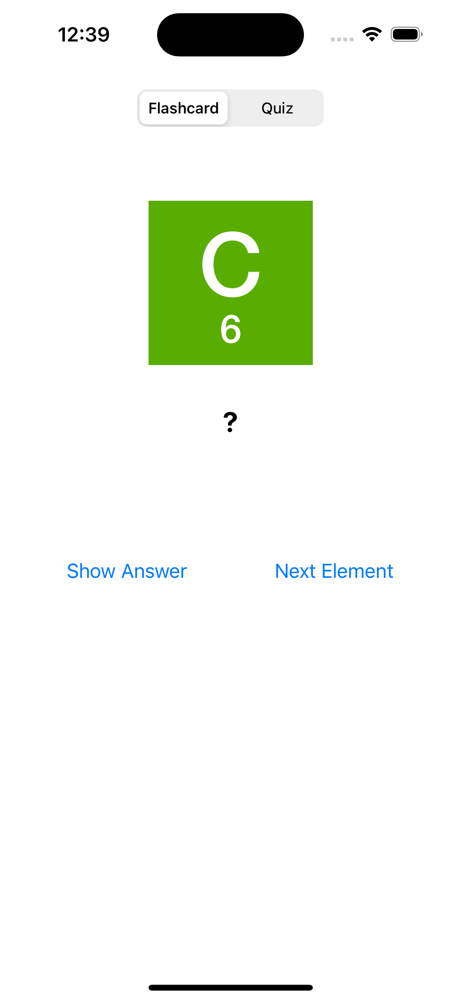
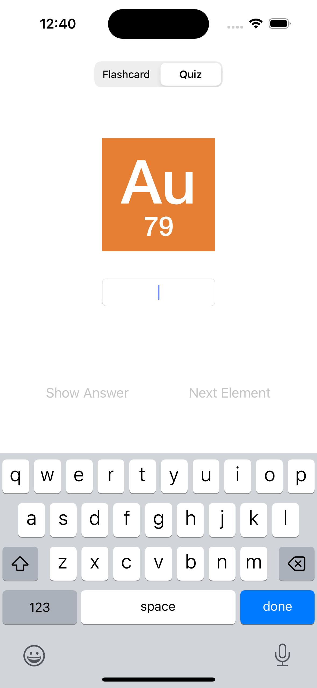
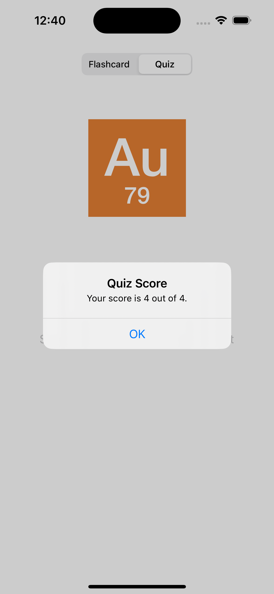

# ElementQuiz

<kbd></kbd> <kbd></kbd> <kbd></kbd>

A flashcard app to study and quiz user on elements of the periodic table

## Description

A lite version of an iOS flashcard app for users to study. There are two modes that users can select from: Flashcard and Quiz. Users are given the ability to practice their set of chemistry elements and check if they had the correct answer. Users can also take a quiz and at the end the score is displayed to user.

## Getting Started

- Make sure you have the Xcode version 14.0 or above installed on your computer

- Download the ElementQuiz project files from the repository

- Open the project files in Xcode

- Review code and make sure you understand what it does

- Run active scheme

You should see the application run on simulated device or hardware device of your choosing. Navigating between controllers should be fairly easy. If you have any issues or need help, feel free to contact me for assistance.

## Contributing

Pull requests are welcome. For major changes, please open an issue first
to discuss what you would like to change.

Please make sure to update tests as appropriate.

## License

[MIT](https://choosealicense.com/licenses/mit/)
